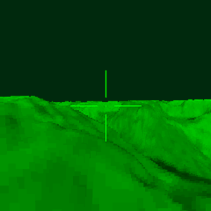

# Comanche Voxel Space engine (C & SDL)

This is an incredibly naive Voxel Space implementation written in C99 & SDL.

The player movement uses velocity, acceleration, allowing for strafe, pitch, yaw, and a small degree of roll as we turn left and right.

You can also define NIGHT_MODE to enable a night-vision effect, which is similar to the one found in Novalogic's Comanche game from 1992.

For more information, visit:
[https://pikuma.com](https://pikuma.com)